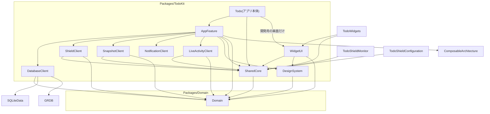
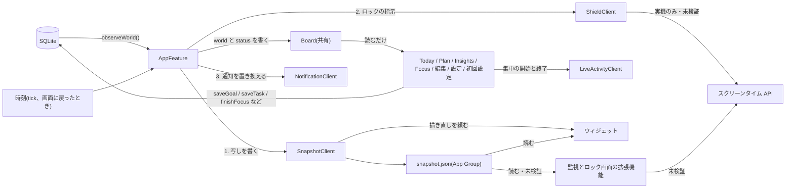

# 設計の全体像

最終更新: 2026-10-09(`develop` の 26c5daf 時点のコードに基づく。PR #16 まで)

コードがどう組まれているかをまとめます。決定の理由は [adr/](adr/README.md) にあります。
まだ作っていないものは「未実装」、動作を確かめていないものは「未検証」と書きます。

## 要点

- ロックの状態は保存しない。保存データと現在時刻から、毎回 `LockEngine` で計算し直す。
- 保存データは `World` という1つの値にまとめ、変更のたびに丸ごと読み直す。
- `World` と、そこから計算した `LockStatus` を `Board` に入れて全画面で共有する。書くのは `AppFeature` だけ。
- 外の世界(DB、スクリーンタイム、通知、Live Activity、写し)には、依存(`*Client`)を通して触る。
- 拡張機能とウィジェットは DB を開かない。アプリ本体が書いた写し(`snapshot.json`)を読み、同じ `LockEngine` で計算する。
- アプリの外(写し、ロック、通知)へは、`AppFeature.syncOutside` の1か所から、決まった順で伝える。保存データが変わるたびに伝える([ADR 0008](adr/0008-single-sync-point-for-extensions.md))。
- 実際のロックは未検証。シミュレータでは模擬の実装が動く。

## 1. モジュール

ローカルの Swift パッケージが2つあります。

| パッケージ | モジュール | 役割 | 依存 |
|---|---|---|---|
| `Packages/Domain` | `Domain` | 純粋なロジックと型。1日の区切り、ロックの判定、余裕、ロック予報、週間の見込み、片づけたあとの見通し、ロックの指示(`ShieldPlan`)、見積もりの補正、1行入力の読み取り、振り返りの集計 | Foundation のみ |
| `Packages/TodoKit` | `AppFeature` | すべての画面の Reducer と View、文言カタログ、見本データ、プレビュー | 下の `*Client`、`SharedCore`、`DesignSystem`、`Domain`、TCA |
| | `DatabaseClient` | 保存データの窓口。SQLite の実装とメモリ上の実装 | `Domain`、Dependencies、SQLiteData、GRDB |
| | `ShieldClient` | アプリをロックする仕組みとの境界。実機用と模擬の実装、アプリを選ぶ画面 | `Domain`、`SharedCore`、Dependencies |
| | `SnapshotClient` | 写しを書き出し、ウィジェットに描き直しを頼む窓口 | `Domain`、`SharedCore`、Dependencies、WidgetKit |
| | `NotificationClient` | 端末の通知の窓口。予約済みの通知を、渡したものに置き換える | Dependencies |
| | `LiveActivityClient` | 集中の計測を Live Activity として出す窓口 | `Domain`、`SharedCore`、Dependencies |
| | `SharedCore` | 拡張機能にも入れる部分。中身は下の表 | `Domain`、Apple 標準のみ |
| | `WidgetUI` | ウィジェットと Live Activity の見た目、その文言カタログ。ウィジェットの見た目をアプリの中に並べる開発用の画面(`WidgetGallery`。デバッグビルドのみ) | `Domain`、`SharedCore`、`DesignSystem` |
| | `DesignSystem` | 色(`Mood`)、背景、カード、ボタン、進み具合の輪、時間の表示、主役の大きな文字(`Font.hero`)、達成時の演出(Metal のシェーダーによる波紋、光の粒、Core Haptics の振動) | `Domain`、SwiftUI |

開発用の画面 `WidgetGallery` は、アプリ本体(`App/Sources/TodoApp.swift`)が直接出します。`AppFeature` は `WidgetUI` に依存しません。見本データは、`AppFeature` の `SampleWorlds` から受け取ります。

`SharedCore` の中身は次のとおりです。

| ファイル | 型 | 内容 |
|---|---|---|
| `AppGroup.swift` | `AppGroup` | App Group の識別子、共有フォルダ、共有の `UserDefaults` |
| `SnapshotStore.swift` | `Snapshot`、`SnapshotStore` | 保存データの写し(`snapshot.json`)の読み書き |
| `ScreenTime.swift` | `SelectionStore`、`ShieldApplier`、`MonitorScheduler` | ロックするアプリの選択の保存、シールドの設定と解除、起こしてもらう時刻の予約。中身は実機向けのビルドでだけ有効になる。**未検証** |
| `FocusActivityAttributes.swift` | `FocusActivityAttributes` | Live Activity に渡す情報 |
| `DeepLink.swift` | `DeepLink`、`PendingDeepLink` | アプリの外から開くときの行き先と、拡張機能からアプリへの受け渡し |

アプリのターゲットは4つです(`project.yml`)。

| ターゲット | 場所 | 中身 | 依存 |
|---|---|---|---|
| `Todo` | `App/`、`Extensions/Shared/` | アプリ本体。`RootView` を表示し、開発用の構成でだけ起動引数 `-sampleData` と `-sampleTab` を読む。どちらも `RootView` に渡すだけ | `AppFeature`、`SharedCore` |
| `TodoWidgets` | `Extensions/Widgets/`、`Extensions/Shared/` | ウィジェットと Live Activity の入口。コントロールセンターに置くボタン(`FocusControl`)だけは、ここに実装がある | `WidgetUI`、`SharedCore` |
| `TodoShieldMonitor` | `Extensions/ShieldMonitor/` | 予約した時刻に起こされ、ロックを掛け直す。**未検証** | `SharedCore` |
| `TodoShieldConfiguration` | `Extensions/ShieldConfiguration/` | ロックされたアプリを開いたときの画面の文言と色を決める。**未検証** | `SharedCore` |

`Extensions/Shared/` にあるのは `StartFocusIntent.swift` の1ファイルです。コントロールセンターのボタンが呼ぶ App Intent で、アプリ本体とウィジェットの拡張機能の両方に入れます。アプリを開く App Intent は、開かれる側のアプリにも定義が要るためです(コードのコメントによる。実機では未確認)。

このほかに、UI テストのターゲット `TodoUITests`(`UITests/`)があります。

`Domain` を別のパッケージにしているのは、macOS 上で `swift test` を回すためです。`TodoKit` は iOS 専用で、シミュレータが要ります。

画面は機能ごとのターゲットに分けず、1つの `AppFeature` ターゲットにフォルダで分けて置いています(`App/`、`Today/`、`Focus/`、`Plan/`、`Editors/`、`Insights/`、`Settings/`、`Onboarding/`、`Support/`)。ビルドが遅くなったら分割します。

拡張機能は使えるメモリが小さいので、TCA と DB を入れません。スクリーンタイムの2つは `SharedCore` だけに、ウィジェットは `WidgetUI` と `SharedCore` に依存します。

図では省いていますが、`*Client` の5つは swift-dependencies にも依存します。

外部ライブラリは `Packages/TodoKit/Package.swift` に書いた4つです。

| ライブラリ | 指定 | 解決済みの版 |
|---|---|---|
| swift-composable-architecture | 1.26.0 以上 | 1.26.2 |
| sqlite-data | 1.12.0 以上 | 1.12.0 |
| swift-dependencies | 1.17.0 以上 | 1.17.1 |
| GRDB.swift | 7.6.0 以上 | 7.11.1 |

## 2. データの流れ

### 2.1 読み取り

1. `AppView` が表示されると `AppFeature` に `.task` を送る。
2. `AppFeature` は `database.observeWorld()` を購読する。SQLite の実装は、GRDB の `ValueObservation` で `fetchWorld` を見張る。関係する表が変わるたびに `World` を読み直し、前と同じ値なら流さない。
3. `World` が届くと `.worldChanged` で `Board.world` に入れ、`LockEngine.status(world:now:)` で `Board.status` を計算し直す。
4. 各画面は `@SharedReader(.board)` で `Board` を読む。`Board` はメモリ上の共有値(`.inMemory("board")`)で、ディスクには保存しない。

`World` は目標、タスク、集中の記録、パスの記録、計測中の集中、設定のすべてです。データ量が小さい前提で、変更のたびに丸ごと読み直しています。記録が増えたときの上限は決めていません(「分かっている制限」を参照)。

最初の `World` が届いたときだけ、続きを戻します(`restore`)。初回設定がまだなら初回設定を出し、計測中の集中が残っていれば計測の画面に戻します。そのあと、読み終える前に届いていた外からの依頼(`pendingDeepLink`)があれば開きます(4 を参照)。

### 2.2 書き込み

各画面の Reducer が `DatabaseClient` の操作を直接呼びます。`Board` は書き換えません。書いた結果は 2.1 の監視を通って戻ってきます。

| 操作 | 使う場面 |
|---|---|
| `saveGoal`、`deleteGoal` | 目標の追加、編集、削除。初回設定の最初の目標 |
| `saveTask`、`deleteTask` | タスクの追加、編集、着手(`startedAt`)、完了、取り下げ、未完了に戻す、削除 |
| `setActiveFocus` | 集中の計測を始める |
| `finishFocus` | 集中の計測を終える。記録を足すのと、計測中の状態を消すのを、1回の書き込み(トランザクション)で行う |
| `addPassUse` | パスを使う |
| `savePreferences` | 設定の変更、初回設定の完了 |
| `replaceAll` | 保存データの入れ替え。いまは、この操作自身のテストからしか呼んでいない |

`finishFocus` を1回の書き込みにしているのは、別々に書くと、その間だけ「記録も計測中もある」状態になり、進み具合を二重に数えるためです。`addSession`(記録を1件足す)も残っていますが、いまの画面からは呼んでいません。

### 2.3 時刻による更新

時間がたつだけでロックの状態は変わります(着手リミットを過ぎる、パスが切れる、日付が変わる)。`AppFeature` は次のときに計算し直します。

| きっかけ | 内容 |
|---|---|
| `.tick` | `LockStatus.nextChangeAt`(次に状態が変わる時刻)の直後。予定がなくても 15 秒ごと。最短 0.2 秒 |
| `.becameActive` | アプリが前面に戻ったとき |
| `.worldChanged` | 保存データが変わったとき |

画面の「あと◯分」は `Text(timerInterval:)` で OS が毎秒描き直すので、状態を毎秒更新してはいません。

### 2.4 アプリの外への連絡

計算し直すたびに、`AppFeature.syncOutside(_:worldChanged:)` が `ShieldPlan(status:activeFocus:)` を作り、アプリの外へ伝えるかどうかを決めます。理由は [ADR 0008](adr/0008-single-sync-point-for-extensions.md) にあります。

| きっかけ | 伝えるか |
|---|---|
| `.worldChanged`(保存データが変わった) | 必ず伝える。`ShieldPlan` が前と同じでも伝える |
| `.tick`、`.becameActive`(時間がたっただけ) | `ShieldPlan` が、前回伝えたもの(`appliedPlan`)と違うときだけ |

保存データが変わったときに必ず伝えるのは、ロックの状態が同じでも、写しや予約の中身が変わっていることがあるためです。たとえば、今日作った目標は今日はロックしないので `ShieldPlan` は変わりませんが、明日の朝の予約と、ウィジェットの表示には要ります。

伝える順は決まっています。

1. `snapshot.save(world)` で写しを書き、ウィジェットに描き直しを頼む。
2. `shield.apply(plan, world)` で、ロックを掛けるか外すかと、予約を伝える。
3. `notifications.replaceAll(warnings)` で、予約済みの通知をすべて捨てて作り直す。

写しを先に書くのは、スクリーンタイムの拡張機能が、予約の時刻に最新の状況で判定できるようにするためです。

続けて変更が来たら、古い連絡は途中でやめます(`cancelInFlight`)。各段階のあいだで取り消しを確かめるので、古い指示が、新しい指示のあとから伝わることはありません。通知の置き換えは、通知を1件予約するごとにも取り消しを確かめます。

それぞれの実装は次のとおりです。

| 依存 | 実装 | 使われる場面 | すること |
|---|---|---|---|
| `SnapshotClient` | `liveValue` | アプリ本体 | `SnapshotStore.save` で写しを書き、`WidgetCenter.shared.reloadAllTimelines()` を呼ぶ |
| | `testValue`、`previewValue` | テスト、プレビュー | 何もしない |
| `ShieldClient` | `simulated()` | シミュレータ、プレビュー | ロックの切り替わりをログに出す。何もロックしない |
| | `screenTime()` | 実機 | `ShieldApplier.apply` で `ManagedSettingsStore` にシールドを設定または解除する。`MonitorScheduler.reschedule` で `DeviceActivityCenter` の予約を張り直す。**未検証** |
| `NotificationClient` | `liveValue` | アプリ本体 | 予約済みの通知をすべて消し、渡された通知のうち、これから来るものを予約する。次の置き換えが始まっていたら、途中でやめる |
| | `testValue`、`previewValue` | テスト、プレビュー | 何もしない |

`ShieldClient` の実装は、写しを書きません。写しは、呼び出し側(`syncOutside`)が先に書いています。

`ShieldClient` のどちらを使うかはスキームではなく、ビルド先で決まります(`#if canImport(FamilyControls) && !targetEnvironment(simulator)`)。実機に入れた `Todo-Dev` は本物の API を呼びます。

`syncOutside` を通らない `shield.apply` が1つだけあります。設定でロックするアプリを選び直したとき、`SettingsFeature` が直接呼びます。いま掛かっているロックにすぐ反映するためです。

通知は、これから始まるロックの理由(近い順に 8 件まで)について、「30 分前」と「始まったとき」の2通を予約します(`AppFeature.warnings(for:)`)。30 分前がもう過ぎていれば、始まったときの1通だけです。許可は、初回設定を終えた直後に求めます。

### 2.5 写しと、それを読むもの

拡張機能はメモリの制限が厳しいので、DB を開かせません。代わりに `SnapshotStore` が App Group のフォルダに `snapshot.json` を書きます。書くのは `SnapshotClient.save` の中(2.4 の 1)です。中身は `World` を絞ったものと、書いた時刻です。

- 集中の記録は直近 2 日ぶんだけ
- タスクは未完了のすべてと、片づけたもののうち新しい 20 件(見積もりの補正に使う)

App Group の識別子は `Info.plist` の `AppGroupIdentifier` から読みます。フォルダが取れない環境では、書き出しは何もせずに終わります。

写しを読むのは次の3つです。どれも `LockEngine` で状態を計算し直します。

| 読む側 | すること |
|---|---|
| ウィジェット(`SlackWidget`) | いまの状態と、時間の経過で状態が変わる時刻ごとの状態を、8 個まで先読みして並べる。使い切ったら作り直す。アプリ本体が写しを書くたびにも作り直す。横長のウィジェットは、右側に今日のロック予報(まだ片づいていないものを 3 件まで)を出す |
| 監視の拡張機能(`ShieldMonitorExtension`) | 予約の区間の開始と終了で起こされ、`ShieldApplier.refresh` でロックを掛け直す。どの予約で起きたかは見ない。**未検証** |
| ロック画面の拡張機能(`ShieldConfigurationExtension`) | いちばん先に片づけるものの名前と、今日の分の残りを出す。残りは、開いた時点で写しから計算する。写しが読めなければ決まった文言を出す。**未検証** |

### 2.6 Live Activity

集中の計測を始めると、`FocusFeature` が `liveActivity.start` を呼び、ロック画面と Dynamic Island に残り時間を出します。計測を終えると `liveActivity.end` で消します。渡す情報の型(`FocusActivityAttributes`)は、アプリ本体とウィジェットの両方が使うので `SharedCore` にあります。

Live Activity に出るのは集中の計測だけです。次のロックまでの余裕は、ウィジェットに出します。

始められなかったとき(利用者が無効にしている、要求が失敗した)は、ログに残すだけで、計測は続けます。

シミュレータでは、開始の要求が通り、システムに登録されることをログで確かめました。画面に出た様子は、まだ見ていません。

## 3. ロックのモデル

### 3.1 LockEngine

`LockEngine.status(world:now:)` は状態を持たない純粋な計算です。同じ入力には同じ `LockStatus` を返します。アプリ本体からも拡張機能からも呼べるように `Domain` に置いています。

ロックの理由(`LockReason`)は2種類です。

| 理由 | 対象 | 理由になり始める時刻 |
|---|---|---|
| 目標 | 保管していない目標のうち、今日が「やる曜日」で、1日の量が 0 より大きく、今日の分が終わっていないもの | 「朝から」は1日の開始時刻。「時刻を指定」はその時刻。**作った当日は理由にならない** |
| タスク | 未完了(完了も取り下げもしていない)のタスクすべて | 着手リミット = 締切 −(見積もり × 倍率)。「見積もりどおり」にしたタスク(`usesExactEstimate`)は、倍率を掛けない |

今日の分の進み具合は、今日始めた記録の合計に、計測中のぶんを足したものです。計測を止めなくても、達した時点で理由が消えます。計測が1日の区切りをまたいでいるときは、区切りより後のぶんだけを今日に数えます。

理由を「始まっているもの(`activeReasons`)」と「これからのもの(`upcomingReasons`)」に分け、次のように状態(`Phase`)を決めます。

| 条件 | 状態 |
|---|---|
| 始まっている理由がない | `.free(nextLockAt:)`。次のロックは、これからの理由のいちばん早い時刻と、明日以降 7 日以内で最初に目標がロックを始める時刻の早いほう |
| 始まっている理由があり、有効なパスがある | `.onPass(until:)` |
| 始まっている理由があり、パスがない | `.locked` |

### 3.2 LockStatus

| 項目 | 内容 |
|---|---|
| `now`、`today` | 計算した時刻と、それを含む1日の区間 |
| `phase` | 上の表の状態 |
| `goals` | 今日が「やる曜日」の目標の進み具合(`GoalProgress`) |
| `activeReasons`、`upcomingReasons` | ロックの理由。始まる順。これからの理由に入るのは、今日の目標と、未完了のタスクすべて |
| `forecast` | ロック予報。今日の目標、今日のうちに着手リミットが来る(または過ぎた)タスク、今日完了したタスク。状態は「済み」「いま有効」「これから」 |
| `passesRemaining` | 今週(月曜の1日の開始から)使えるパスの残り |
| `nextChangeAt` | 時間の経過だけで状態が変わりうる次の時刻。これからの理由の先頭、パスの終わり、1日の終わりのうち最も早いもの |
| `slack` | 余裕(秒)。自由なら次のロックまで、パス中ならパスの終わりまで、ロック中は nil |
| `isFreeForToday` | 今日はもうロックの予定がない |
| `canUsePass` | ロック中で、パスが残っている |

「1日」と「1週間」の区切りは `DayClock` が決めます。1日は設定した時刻(初期値は朝 4 時)に始まり、週は月曜に始まります。

`DayClock` は、時刻を「何時間後」ではなく「その暦の日の何時」として求めます。夏時間の切り替え日は1日が 23 時間や 25 時間になるので、時間を足し引きすると1時間ずれるためです([ADR 0009](adr/0009-wall-clock-day-boundaries.md))。

`DayClock.split(from:to:)` は、ある時間を1日の区切りで分けます。区切りをまたいだ集中の計測を、日ごとの記録に分けるのに使います(`FocusFeature`)。記録は「始めた日」のぶんとして数えるので、分けないと、またいだあとのぶんが前の日に入ってしまいます。

### 3.3 先の見通し

`LockEngine` には、`status` のほかに2つの計算があります。どちらも保存データを変えません。

| 計算 | 内容 | 使う場所 |
|---|---|---|
| `preview(resolving:world:now:)` | ある理由をいま片づけたと仮定して、次のロックの時刻を返す(`LockPreview`)。ほかに理由が残るなら「外れない」 | 「今日」のいちばん上。「終えると、次のロックは◯時まで延びます」 |
| `weekOutlook(world:now:days:)` | 今日から 7 日ぶんの、日ごとのロックの見込み(`DayOutlook`)。今日は `forecast` をそのまま使い、明日以降は目標とタスクの着手リミットから作る | 「今日」の「これからの7日」 |

`DayOutlook` は、その日の荒れ具合を4段階で表します。予定なし、いつもの目標だけ、締切が1つ、締切が重なっている、です。

### 3.4 見積もりの補正

着手リミットに掛ける倍率は `World.estimateFactor` で決まります。設定が固定(1 / 1.25 / 1.5 / 2 倍)ならその値、「自動」(初期値)なら `EstimateCalibration` の値です。詳しくは [ADR 0007](adr/0007-estimate-calibration.md)。

タスクごとに、倍率を掛けないようにもできます(`TaskItem.usesExactEstimate`。PR #16)。`TaskItem.startLimit(factor:)` が、このタスクには倍率を 1 として計算します。タスクの編集画面の「見積もりどおりの時刻にする」で切り替えます。同じ画面で、切り替えていないタスクには、着手リミットがその時刻になる理由(見積もり、倍率、見込んでいる時間)を出します。

### 3.5 ShieldPlan

`LockStatus` から、スクリーンタイムの層に必要なことだけを抜き出したものです。

`ShieldPlan(status:activeFocus:)` で作ります。

| 項目 | 内容 |
|---|---|
| `isLocked` | いまロックを掛けるべきか(`.locked` のときだけ true。パス中は false) |
| `title` | いちばん先に片づけるものの名前 |
| `wakeTimes` | 状態を見直す時刻。近い順に最大 12 件(`wakeTimeLimit`)。同じ時刻は1つにまとめる |

`wakeTimes` に入るのは次の3種類です。

| 時刻 | 見直す理由 |
|---|---|
| これからの理由(`upcomingReasons`)が始まる時刻 | ロックを掛ける |
| パスが切れる時刻 | ロックに戻す |
| 計測中の集中が、今日の分に達する時刻(計測中で、残りがあるときだけ) | アプリを閉じて勉強していても、達した時点でロックを外す |

「残り何分」のように刻々と変わる値は、`ShieldPlan` に入れません。入れると、内容が変わるたびに予約をやり直すことになるためです。必要な側(ロック画面の拡張機能など)が、写しから自分で計算します。

`wakeTimes` は、アプリを閉じていても拡張機能を起こしてもらうための予約に使います。予約(`MonitorScheduler.reschedule`)は2種類です。どちらも**未検証**です。

| 種類 | 対象 | 上限 | 名前 |
|---|---|---|---|
| 毎日くり返す | 1日の開始時刻と、目標のロックが始まる時刻 | 8 件(早い時刻から) | `daily-<0 時からの分>` |
| 1 回きり | `wakeTimes` のうち、これから来るもの | 12 件 | `once-<番号>` |

- OS が受け付ける予約は 20 件までです。1回きりの 12 件を引いた残りの 8 件を、毎日の予約の上限にしています。
- 1日の開始時刻は、目標が1つもなくても必ず予約します。前の日のロックを、日付が変わった時点で外すためです。
- 毎日の予約は、目標の「やる曜日」を見ません。やらない曜日にも起こされますが、拡張機能は写しから判定し直すだけなので、結果は変わりません。
- 区間の長さは、OS が受け付ける最短の 15 分にしています。拡張機能は、区間の開始と終了の両方で見直します。
- 張り直すときは、いったんすべての予約を止めてから登録し直します。

### 3.6 1行入力の読み取り

`QuickAddParser` は、「金曜までにレポート 2時間」のような1行から、名前、締切、所要時間を読み取ります。ロックのモデルではありませんが、純粋な計算なので `Domain` にあります。日本語と英語の、決まった書き方だけを正規表現で読みます。読み取れなかった部分は名前に残します。

### 3.7 タスクの着手

タスクには計測の画面がありません。代わりに、取りかかった時刻(`TaskItem.startedAt`)を1つ覚えます。ロックの判定には使いません。

| 場面 | 動き |
|---|---|
| 「今日」のいちばん上で「いま始める」を押す | `TodayFeature.startTaskTapped` が、いまの時刻を `startedAt` に入れて保存する。未完了で、まだ始めていないタスクだけ |
| 始めたあと | いちばん上に「作業中」と経過時間を出し、主ボタンが「完了にする」に替わる。始めただけでは、ロックは外れない |
| 完了の確認を開く | `TaskItem.elapsedMinutes(until:)` で、取りかかってからの時間を求める(5 分刻み、最短 5 分)。`TaskCompletionFeature.State(task:measuredMinutes:)` が、それを最初の選択にし、選択肢にも足す |

経過時間には、途中で休んだ時間も入ります。そのため初期値として見せるだけにして、本人が選び直せるようにしています。

## 4. 画面の移動

タブは「今日」「予定」「振り返り」の3つです。それ以外の画面は `AppFeature` の `Destination` として出します。

| `Destination` | 出し方 | 開くきっかけ |
|---|---|---|
| `focus` | 全画面 | 目標の開始。起動時に計測中の集中が残っていた場合も戻す |
| `goalEditor` | シート | 目標の追加、編集 |
| `taskEditor` | シート | タスクの追加、編集 |
| `taskCompletion` | シート | タスクを完了にする(実際にかかった時間を聞く。取りかかった時刻があれば、そこからの時間を初期値にする) |
| `settings` | シート | 「今日」の歯車 |

子の画面は開き方を知りません。`TodayFeature` と `PlanFeature` は `Route`(`startFocus`、`editGoal`、`editTask`、`completeTask`、`openSettings`)を `.delegate` で親に伝え、`AppFeature.open(_:_:)` が `Destination` に変えます。`Route` を足すと、`open` の `switch` がコンパイルエラーになるので、対応漏れに気づけます。

- タスクの編集画面から「完了にする」を押すと、`TaskEditorFeature` が編集中の内容を先に保存し、その内容を `.delegate(.complete(task))` で送ります。`AppFeature` が編集画面を完了の確認に差し替えます。完了の確認をやめても、直した内容は残ります。
- 閉じるときは、子が `@Dependency(\.dismiss)` を呼びます。
- 初回設定は `Destination` ではなく、`AppFeature.State.onboarding` に状態がある間、タブの代わりに表示します。設定の `hasCompletedOnboarding` が false なら出ます。設定画面の「はじめの説明をもう一度見る」は、この値を false に戻すだけです。
- 保存データを読み終える前(`Board.isLoaded == false`)は背景だけを出します。読み終える前に初回設定を出さないためです。
- ロックするアプリを選ぶ画面は、`Destination` ではなく、設定と初回設定の View に付けた `shieldAppPicker` で出します(`ShieldClient` にある View の拡張)。実機では OS の選択画面(`FamilyActivityPicker`)、シミュレータでは「選べません」という説明が出ます。

### アプリの外から開く

アプリの外から、特定の場面を開けます。行き先は `DeepLink` で表します。

| 行き先 | 開くもの | 使っている場所 |
|---|---|---|
| `DeepLink.focus`(`lockcast://focus`) | いちばん先にやるべき目標の計測。ロックの理由になっている目標を優先し、なければ、まだ終えていない今日の分。どちらもなければ「今日」のタブ | ウィジェットを押したとき、コントロールセンターのボタン |
| `DeepLink.addTask`(`lockcast://add-task`) | タスクの追加 | いまは使っている場所がない |

URL スキームは構成ごとに違い、本番用は `lockcast`、開発用は `lockcast-dev` です(`Info.plist` の `AppURLScheme`)。両方を同じ端末に入れても混ざりません。

届く道は2つあります。

| 入口 | 届き方 |
|---|---|
| ウィジェット | `widgetURL(DeepLink.focus.url)` で URL を開く。`AppView` が `.onOpenURL` で受け取る |
| コントロールセンターのボタン(`FocusControl`) | `StartFocusIntent` がアプリを開く。App Intent は行き先を渡せないので、`PendingDeepLink.set(.focus)` で App Group の `UserDefaults` に書いておく。`AppView` は、前面に出るたびに `PendingDeepLink.take()` で読み取り、消す。**アプリが開いて計測の画面まで進むことは、まだ確かめていない** |

どちらも `AppFeature` の `.openDeepLink` に届き、`Route` と同じ `open(_:_:)` で開きます。

| 届いたときの状態 | 動き |
|---|---|
| 保存データを読み終える前(アプリが起動していない状態から開かれた) | `AppFeature.State.pendingDeepLink` に覚えておき、読み終えて続きを戻したあとに開く |
| 初回設定の途中、または、すでに何かを開いている | 何もしない(割り込まない) |
| それ以外 | すぐに開く |

## 5. 永続化

SQLite に保存します。場所は `SQLiteData.defaultDatabase()` が決め、プレビューとテストでは一時的なデータベースになります。開けなかったときはメモリ上の実装に切り替えて起動を続けます(保存はされません)。

表は移行 `v1: 最初の表`(`Schema.swift`)で作ります。すべて `STRICT` です。日時は 1970 年からの秒数(REAL)、ID は UUID の文字列(TEXT)です。

移行は `v1` の1つだけです。`tasks.startedAt` と `tasks.usesExactEstimate` は、まだ一度も配布していないので、新しい移行を足さずに `v1` に入れました。それより前の `v1` で作った DB が手元のシミュレータに残っているときは、アプリを消して入れ直します([開発の手順](development.md) 6)。

**`goals`**(目標)

| 列 | 型 | 内容 |
|---|---|---|
| `id` | TEXT、主キー | |
| `title` | TEXT | |
| `symbol` | TEXT | SF Symbols の名前 |
| `tint` | TEXT | 色の名前(`indigo` など 8 種) |
| `dailyMinutes` | INTEGER | 1日の量(分) |
| `weekdays` | INTEGER | やる曜日のビット集合。日曜が `1 << 1`、土曜が `1 << 7` |
| `lockStartMinutes` | INTEGER、NULL 可 | NULL なら「朝から」。値があれば 0 時からの分 |
| `isArchived` | INTEGER、既定 0 | 保管済みか。**いまは画面から変えられない** |
| `createdAt` | REAL | |

**`tasks`**(タスク)

| 列 | 型 | 内容 |
|---|---|---|
| `id` | TEXT、主キー | |
| `title` | TEXT | |
| `dueAt` | REAL | 締切 |
| `estimateMinutes` | INTEGER | 見積もり(分) |
| `usesExactEstimate` | INTEGER、既定 0 | 着手リミットを、見積もりどおり(倍率なし)で計算するか |
| `startedAt` | REAL、NULL 可 | 取りかかった時刻。「いま始める」を押したときに入る |
| `actualMinutes` | INTEGER、NULL 可 | 実際にかかった時間(分)。完了のときに本人が答える。見積もりの補正に使う |
| `completedAt` | REAL、NULL 可 | 完了した時刻 |
| `withdrawnAt` | REAL、NULL 可 | 取り下げた時刻 |
| `createdAt` | REAL | |

**`sessions`**(集中の記録)

| 列 | 型 | 内容 |
|---|---|---|
| `id` | TEXT、主キー | |
| `goalID` | TEXT | `goals.id` を参照。目標を消すと記録も消える(`ON DELETE CASCADE`) |
| `startedAt` | REAL | |
| `seconds` | INTEGER | |

索引 `idx_sessions_goalID_startedAt`(`goalID`, `startedAt`)があります。

**`passUses`**(パスの記録)

| 列 | 型 | 内容 |
|---|---|---|
| `id` | TEXT、主キー | |
| `usedAt` | REAL | |
| `minutes` | INTEGER | 外れる長さ(分) |

**`appState`**(1行だけの表)

| 列 | 型 | 内容 |
|---|---|---|
| `id` | INTEGER、主キー | 常に 1(`CHECK`) |
| `preferences` | TEXT | 設定(`Preferences`)を JSON にしたもの。欠けた項目は初期値で補う |
| `activeFocusGoalID` | TEXT、NULL 可 | 計測中の集中の目標。目標を消すと NULL になる(`ON DELETE SET NULL`) |
| `activeFocusStartedAt` | REAL、NULL 可 | 計測を始めた時刻 |

設定を JSON の1列にしているのは、項目を足すたびに表の形を変えずに済ませるためです。

行の型(`GoalRecord` など)は `DatabaseClient` の中に閉じていて、外には `Domain` の型だけが出ます。

DB のほかに保存しているものが3つあります。どれも App Group にあります。

| もの | 場所 | 内容 |
|---|---|---|
| 写し | `snapshot.json` | 2.5 を参照。DB から作り直せる |
| ロックするアプリの選択 | App Group の `UserDefaults`(キー `shieldSelection`) | `FamilyActivitySelection` を JSON にしたもの。実機のみ。アプリからは、どのアプリかは分からない |
| 開いてほしい行き先 | App Group の `UserDefaults`(キー `pendingDeepLink`) | コントロールセンターのボタンが書き、アプリが読んで消す。URL の文字列 |

## 6. 文言と多言語

文言カタログは5つあります。どれも元の言語は英語で、日本語と英語の両方を入れます(2026-10-09 時点で抜けなし)。

| カタログ | 件数 | 参照のしかた |
|---|---|---|
| `Packages/TodoKit/Sources/AppFeature/Resources/Localizable.xcstrings` | 161 | 生成されたシンボル(`Text(.todaySlackLabel)`) |
| `Packages/TodoKit/Sources/WidgetUI/Resources/Localizable.xcstrings` | 17 | 生成されたシンボル(`Text(.widgetSlackName)`) |
| `Extensions/ShieldConfiguration/Localizable.xcstrings` | 5 | キーの文字列(`String(localized: "shield.button")`) |
| `Extensions/Widgets/Localizable.xcstrings` | 2 | キーの文字列(`Label("control.focus.title", …)`)。コントロールセンターのボタンの名前と説明 |
| `App/Resources/Localizable.xcstrings` | 2 | キーの文字列。上と同じ2件。`StartFocusIntent` をアプリ本体にも入れているため |

- 生成されたシンボルで参照するのが原則です。キーを文字列で書きません。詳しくは [ADR 0006](adr/0006-string-catalog-symbols.md) と[開発の手順](development.md)。拡張機能の側と `App/` にある3つのカタログは、キーの文字列で参照しています。コントロールセンターのボタンは、App Intents の名前がビルド時に文字列リテラルから読み取られるためです(コードのコメントによる)。ロック画面のほうは、理由の記載がありません。
- `control.focus.title` と `control.focus.description` は、2つのカタログに同じものがあります。直すときは両方を直します。
- 時間の長さ、時刻、曜日は文言にせず、`DurationText`、`TimeText`、`Calendar` の書式で言語に合わせます。
- 通知の文言は、予約した時点の言語で固定されます。
- 見本データの目標名とタスク名はカタログに入れず、`SampleData` の中で端末の言語を見て切り替えています。

## 7. テスト

2026-10-09 時点で、下のテストはすべて通っています。`Domain`、Reducer、`DatabaseClient` は PR #16 の時点、UI テストは PR #14 の時点で確かめました(シミュレータは iPhone Air、iOS 27.0)。`make lint` も通ります。

| 対象 | 場所 | 実行 | 件数 | 確かめていること |
|---|---|---|---|---|
| `Domain` | `Packages/Domain/Tests/DomainTests` | `make test-domain`(macOS、シミュレータ不要) | 69 | 1日と1週間の区切り(夏時間、区切りでの分割を含む)、ロックの判定、片づけたあとの見通し、週間の見込み、見積もりの補正、1行入力の読み取り、振り返りの集計 |
| Reducer | `Packages/TodoKit/Tests/AppFeatureTests` | `make test-app` | 196 | すべての画面の Reducer。アプリの外への連絡の順と取り消し、外からの依頼、通知の内容、今日の行の並べ方も含む |
| `DatabaseClient` | `Packages/TodoKit/Tests/DatabaseClientTests` | `make test-app` | 8 | 実際の SQLite(テストごとの一時データベース)に対する読み書き、連鎖削除、変更の通知 |
| UI | `UITests` | `make test-ui`(`make test-app` にも含まれる) | 30 | 見本データで起動し、起動時の表示(4つの状態、日本語と英語)、初回設定、集中の開始と停止、目標とタスクの追加、1行入力の提案、タスクの完了、「いま始める」から完了まで、タブ、設定、振り返りを通す |

方針は次のとおりです。

- 判定と計算は `Domain` に置き、境界の値(ちょうどの時刻、0 件、日付の変わり目)を含めてテストする。ロックの判定を間違えると、外れない、または掛からないという一番困る不具合になるため。
- Reducer は TCA の `TestStore` で確かめる。時刻、ID、DB、ロックは依存を差し替えて固定する。そのために、`AppFeature` の中では `Date()` や `UUID()` を直接呼ばない(SwiftLint の独自ルールで検査。外の世界との境界である `*Client` と `SharedCore` は対象外)。
- 写し、通知、Live Activity の依存は、テストとプレビューでは何もしない実装になる。各テストが差し替えなくて済む。
- UI テストは、壊れると使えなくなる流れに絞る。見本データで起動するので `Todo-Dev` でだけ動く。要素は識別子(`accessibilityIdentifier`)で探すので、どちらの言語でも同じテストが通る。
- UI テストは、要所で画面の写し(スクリーンショット)をテスト結果に付ける。見た目の確認に使う。取り出し方は[開発の手順](development.md) 2。
- スクリーンタイムのコードは自動テストの対象外。実機で手で確かめる([公開前の確認事項](release-checklist.md))。

自動テストで確かめていないものもあります。

| もの | 理由 |
|---|---|
| ウィジェット、Live Activity、コントロールセンターのボタンの見た目 | OS が描く。UI テストは、計測中にホーム画面へ出て写しを残すだけで、中身は確かめていない。ウィジェットの配置は、開発用の画面(`-sampleTab widgets`)で目で確かめる |
| 今日の分に達したときの演出(波紋、光の粒、振動) | UI テストは、今日の分に達する前に計測を止める |
| `SharedCore`、`*Client` の本番の実装(`DatabaseClient` を除く) | 外の世界に触るため |

主要な画面は、見本データを使った Xcode のプレビューでも確かめられます(`AppFeature/Support/Previews.swift`)。UI テストが撮った画面は、[画面の一覧](../screenshots/README.md)にあります。

## 8. 分かっている制限

2026-10-09 時点で、コードを読んで分かっていることです。

### 未検証、未実装

| 項目 | 状況 |
|---|---|
| 実際のロック | `SharedCore/ScreenTime.swift`、`ShieldClient/Live.swift`、`Extensions/ShieldMonitor`、`Extensions/ShieldConfiguration` は、実機で一度も動かしていない |
| アプリを閉じている間の見直し | 1日の開始時刻の毎日の予約(前の日のロックを外す)と、計測が今日の分に達する時刻の予約(ロックを外す)は、PR #13 で足した。どちらも実機では動かしていない |
| ロックするアプリの選択 | 実機では OS の選択画面を出すコードがある(未検証)。シミュレータでは選べず、模擬の実装が 6 件を選んだことにする |
| ロック画面のボタンの動き | シールドの操作の拡張機能(ShieldAction)がない。ボタンを押したときの動きは決めていない |
| Family Controls の権限 | `project.yml` と entitlements に書いてある。有料の開発者登録がないので、実機向けの署名では確かめていない |
| ウィジェットの見た目 | 配置は、開発用の画面 `WidgetGallery` で確かめた(PR #15。小、横長、ロック画面の長方形と1行。日本語と英語)。枠と背景は OS のものを真似ただけなので、ホーム画面やロック画面に実際に置いた様子は、まだ見ていない |
| Live Activity の見た目 | 開始の要求が通り、システムに登録されることは、シミュレータのログで確かめた。画面に出た様子は見ていない |
| コントロールセンターのボタン | 見た目も、押してアプリが開き計測の画面まで進むことも、確かめていない。`StartFocusIntent` をアプリ本体にも入れたのは、開けないおそれへの対処で、効くかどうかは未確認 |
| 目標の保管 | `Goal.isArchived` と列はあるが、切り替える画面がない。いまは削除だけ |
| タスクの計測の画面 | ない。取りかかった時刻を覚えるだけ(3.7) |
| アプリアイコン | 仮のもの。画像生成のモデルで作った(codex CLI を使用)。権利と利用条件は確かめていない |
| CI | 手動実行のみで、一度も実行していない |

### 設計上の注意点

| 項目 | 内容 |
|---|---|
| アプリの選び直しは、別の道を通る | 設定でロックするアプリを選び直すと、`SettingsFeature` が `shield.apply` を直接呼ぶ。`syncOutside` の取り消しや順序の仕組みの外にある |
| 毎日の予約は 8 件まで | 目標ごとに違う時刻を指定して、1日の開始時刻と合わせて 9 種類以上になると、時刻の遅いものは毎日の予約に入らない。その時刻は、当日にアプリが連絡し直して1回きりの予約に入れないかぎり、起こされない |
| 明日の目標の前触れがない | 通知の対象は、今日の目標と未完了のタスクだけ。明日の朝に始まる目標のロックは、その日にアプリが計算し直すまで、通知の対象に入らない |
| 計測がアプリの外で終わったとき | 今日の分に達した時刻に、予約で起こされた拡張機能がロックを外す見込み(未検証)。Live Activity は、アプリを開き直すまで残る。記録は、次に開いたときに「達した時刻で止まった」ものとして残す |
| 1日の区切りをまたぐ計測の「達した」判定 | 計測の画面は、始めた時点の残りから、達する時刻と「達した」の表示を決める。区切りをまたぐと、記録は日ごとに分かれるので、どちらの日の分にも届いていないのに「達した」と出ることがある |
| タスクの着手は、いちばん上からだけ | 「いま始める」が出るのは、そのタスクがロック(またはパス中)のいちばん先の理由になっているときだけ。ロック予報の行や「予定」からは始められない。始めたことを取り消す操作もない |
| 取りかかってからの時間に上限がない | 前の日に始めたタスクを完了にすると、1日ぶんの時間が初期値になる。未完了に戻しても `startedAt` は消えない。休んだ時間も入るので、そのまま確定すると、見積もりの倍率が上がりやすい(倍率そのものは 3.0 で頭打ち) |
| 振り返りの「ロックの前に完了」 | いまの倍率で着手リミットを計算し直して数える。倍率が変わると、過去のタスクの分類も変わる |
| 削除と取り下げ | タスクを削除すると、取り下げの回数に数えられずに理由が消える。目標を削除して作り直すと、その日はロックされない |
| 許可の取り消し | スクリーンタイムの許可の状態を見るのは、初回設定と設定の画面だけ。設定アプリで許可を切られても、ほかの画面は気づかない |
| 外からの依頼は、割り込まない | 初回設定の途中や、すでに何かを開いているときに届いた依頼は捨てる。あとで開き直しはしない |
| 「完了にする」のボタンの読み上げ | 記号だけの完了ボタンが、VoiceOver で「選択中」と読まれていた。PR #14 で、ロック予報の行、「この先の締切」、「予定」の3か所のボタンから、その特性を外した。「今日」のいちばん上、タスクの編集画面、完了の確認にある、文字つきの「完了にする」のボタンは変えていない。こちらがどう読まれるかは確かめていない |
| 「見積もりどおり」は、すぐに効く | ロック中に切り替えると、着手リミットが後ろへずれて、ロックが外れる。締切や見積もりの編集と同じ種類の抜け道で、塞いでいない |
| `AppFeature` が `WidgetUI` に依存している | 開発用の画面 `WidgetGallery` のため(PR #15)。開発ガイド(`CLAUDE.md`)のモジュールの表は、これを認めていない。表を直すか、画面の置き場を変えるかを決める |
| 依存を通さない時刻 | `AppFeature` の中でも、`TimeText`、`GoalEditorView` の一部、見本データ、プレビューは `Calendar.current` や現在時刻を直接使う。ウィジェット、拡張機能、`*Client` の実装が直接使うのは意図どおり |
| `World` の読み直し | 集中の記録とパスの記録を全件読む。件数の上限や古い記録の整理は決めていない |
