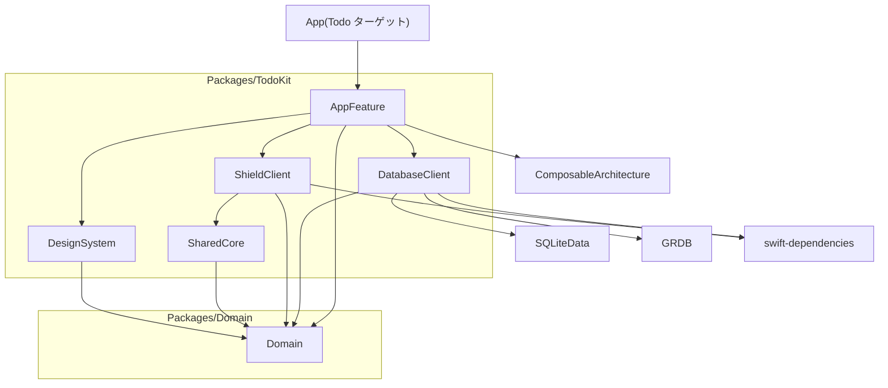
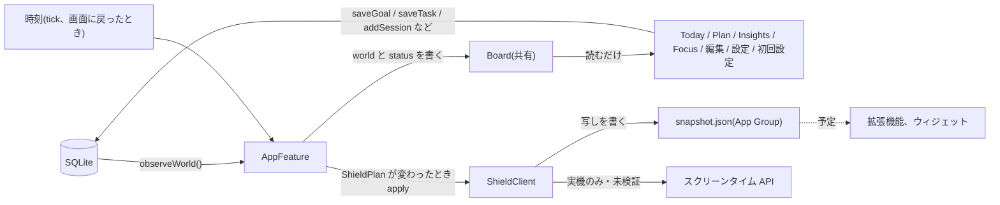

# 設計の全体像

最終更新: 2026-10-09(`develop` の d6a0918 時点のコードに基づく)

コードがどう組まれているかをまとめます。決定の理由は [adr/](adr/README.md) にあります。
まだ作っていないものは「予定」、動作を確かめていないものは「未検証」と書きます。

## 要点

- ロックの状態は保存しない。保存データと現在時刻から、毎回 `LockEngine` で計算し直す。
- 保存データは `World` という1つの値にまとめ、変更のたびに丸ごと読み直す。
- `World` と、そこから計算した `LockStatus` を `Board` に入れて全画面で共有する。書くのは `AppFeature` だけ。
- 外の世界(DB、スクリーンタイム)には `DatabaseClient` と `ShieldClient` を通して触る。
- 実際のロックは未検証。シミュレータでは模擬の実装が動く。

## 1. モジュール

ローカルの Swift パッケージが2つあります。

| パッケージ | モジュール | 役割 | 依存 |
|---|---|---|---|
| `Packages/Domain` | `Domain` | 純粋なロジックと型。ロックの判定、余裕、ロック予報、見積もりの補正、振り返りの集計 | Foundation のみ |
| `Packages/TodoKit` | `AppFeature` | すべての画面の Reducer と View、文言カタログ、見本データ | `Domain`、`DatabaseClient`、`ShieldClient`、`DesignSystem`、TCA |
| | `DatabaseClient` | 保存データの窓口。SQLite の実装とメモリ上の実装 | `Domain`、Dependencies、SQLiteData、GRDB |
| | `ShieldClient` | アプリをロックする仕組みとの境界。実機用と模擬の実装 | `Domain`、`SharedCore`、Dependencies |
| | `SharedCore` | 拡張機能にも入れる部分。App Group、保存データの写し、スクリーンタイム API の呼び出し | `Domain`、Apple 標準のみ |
| | `DesignSystem` | 色(`Mood`)、背景、カード、ボタン、進み具合の輪、時間の表示 | `Domain`、SwiftUI |

アプリ本体(`App/`)は `TodoApp.swift` の1ファイルだけです。`AppFeature` の `RootView` を表示し、開発用の構成でだけ起動引数 `-sampleData` を読みます。

`Domain` を別のパッケージにしているのは、macOS 上で `swift test` を回すためです。`TodoKit` は iOS 専用で、シミュレータが要ります。

画面は機能ごとのターゲットに分けず、1つの `AppFeature` ターゲットにフォルダで分けて置いています(`App/`、`Today/`、`Focus/`、`Plan/`、`Editors/`、`Insights/`、`Settings/`、`Onboarding/`、`Support/`)。ビルドが遅くなったら分割します。

外部ライブラリは `Packages/TodoKit/Package.swift` に書いた4つです。

| ライブラリ | 指定 | 解決済みの版 |
|---|---|---|
| swift-composable-architecture | 1.26.0 以上 | 1.26.2 |
| sqlite-data | 1.12.0 以上 | 1.12.0 |
| swift-dependencies | 1.17.0 以上 | 1.17.1 |
| GRDB.swift | 7.6.0 以上 | 7.11.1 |

## 2. データの流れ

### 2.1 読み取り

1. `AppView` が表示されると `AppFeature` に `.task` を送る。
2. `AppFeature` は `database.observeWorld()` を購読する。SQLite の実装は、GRDB の `ValueObservation` で `fetchWorld` を見張る。関係する表が変わるたびに `World` を読み直し、前と同じ値なら流さない。
3. `World` が届くと `.worldChanged` で `Board.world` に入れ、`LockEngine.status(world:now:)` で `Board.status` を計算し直す。
4. 各画面は `@SharedReader(.board)` で `Board` を読む。`Board` はメモリ上の共有値(`.inMemory("board")`)で、ディスクには保存しない。

`World` は目標、タスク、集中の記録、パスの記録、計測中の集中、設定のすべてです。データ量が小さい前提で、変更のたびに丸ごと読み直しています。記録が増えたときの上限は決めていません(「分かっている制限」を参照)。

### 2.2 書き込み

各画面の Reducer が `DatabaseClient` の操作(`saveGoal`、`saveTask`、`addSession`、`addPassUse`、`setActiveFocus`、`savePreferences` など)を直接呼びます。`Board` は書き換えません。書いた結果は 2.1 の監視を通って戻ってきます。

### 2.3 時刻による更新

時間がたつだけでロックの状態は変わります(着手リミットを過ぎる、パスが切れる、日付が変わる)。`AppFeature` は次のときに計算し直します。

| きっかけ | 内容 |
|---|---|
| `.tick` | `LockStatus.nextChangeAt`(次に状態が変わる時刻)の直後。予定がなくても 15 秒ごと。最短 0.2 秒 |
| `.becameActive` | アプリが前面に戻ったとき |
| `.worldChanged` | 保存データが変わったとき |

画面の「あと◯分」は `Text(timerInterval:)` で OS が毎秒描き直すので、状態を毎秒更新してはいません。

### 2.4 ロックへの反映

計算し直すたびに `ShieldPlan(status:)` を作り、前回伝えたもの(`appliedPlan`)と違うときだけ `shield.apply(plan, world)` を呼びます。

| 実装 | 使われる場面 | すること |
|---|---|---|
| `ShieldClient.simulated()` | シミュレータ、プレビュー | 写しを書き出す。ロックの切り替わりをログに出す。何もロックしない |
| `ShieldClient.screenTime()` | 実機 | 写しを書き出す。`ManagedSettingsStore` にシールドを設定または解除する。`DeviceActivityCenter` の予約を張り直す。**未検証** |

どちらを使うかはスキームではなく、ビルド先で決まります(`#if canImport(FamilyControls) && !targetEnvironment(simulator)`)。実機に入れた `Todo-Dev` は本物の API を呼びます。

### 2.5 拡張機能への写し

拡張機能はメモリの制限が厳しいので、DB を開かせません。代わりに `SnapshotStore` が App Group のフォルダに `snapshot.json` を書きます。中身は `World` を絞ったものと、書いた時刻です。

- 集中の記録は直近 2 日ぶんだけ
- タスクは未完了のすべてと、片づけたもののうち新しい 20 件(見積もりの補正に使う)

拡張機能は写しを読み、同じ `LockEngine` で判定する想定です(`ShieldApplier.refresh`)。**拡張機能そのものはまだなく、この関数を呼ぶ場所もありません。** App Group の権限も `project.yml` に設定していないので、フォルダが取れない環境では書き出しは何もせずに終わります。

## 3. ロックのモデル

### 3.1 LockEngine

`LockEngine.status(world:now:)` は状態を持たない純粋な計算です。同じ入力には同じ `LockStatus` を返します。アプリ本体からも拡張機能からも呼べるように `Domain` に置いています。

ロックの理由(`LockReason`)は2種類です。

| 理由 | 対象 | 理由になり始める時刻 |
|---|---|---|
| 目標 | 保管していない目標のうち、今日が「やる曜日」で、1日の量が 0 より大きく、今日の分が終わっていないもの | 「朝から」は1日の開始時刻。「時刻を指定」はその時刻。**作った当日は理由にならない** |
| タスク | 未完了(完了も取り下げもしていない)のタスクすべて | 着手リミット = 締切 −(見積もり × 倍率) |

今日の分の進み具合は、今日始めた記録の合計に、計測中のぶんを足したものです。計測を止めなくても、達した時点で理由が消えます。

理由を「始まっているもの(`activeReasons`)」と「これからのもの(`upcomingReasons`)」に分け、次のように状態(`Phase`)を決めます。

| 条件 | 状態 |
|---|---|
| 始まっている理由がない | `.free(nextLockAt:)`。次のロックは、これからの理由のいちばん早い時刻と、明日以降 7 日以内で最初に目標がロックを始める時刻の早いほう |
| 始まっている理由があり、有効なパスがある | `.onPass(until:)` |
| 始まっている理由があり、パスがない | `.locked` |

### 3.2 LockStatus

| 項目 | 内容 |
|---|---|
| `now`、`today` | 計算した時刻と、それを含む1日の区間 |
| `phase` | 上の表の状態 |
| `goals` | 今日が「やる曜日」の目標の進み具合(`GoalProgress`) |
| `activeReasons`、`upcomingReasons` | ロックの理由。始まる順 |
| `forecast` | ロック予報。今日の目標、今日のうちに着手リミットが来る(または過ぎた)タスク、今日完了したタスク。状態は「済み」「いま有効」「これから」 |
| `passesRemaining` | 今週(月曜の1日の開始から)使えるパスの残り |
| `nextChangeAt` | 時間の経過だけで状態が変わりうる次の時刻。これからの理由の先頭、パスの終わり、1日の終わりのうち最も早いもの |
| `slack` | 余裕(秒)。自由なら次のロックまで、パス中ならパスの終わりまで、ロック中は nil |
| `isFreeForToday` | 今日はもうロックの予定がない |
| `canUsePass` | ロック中で、パスが残っている |

「1日」と「1週間」の区切りは `DayClock` が決めます。1日は設定した時刻(初期値は朝 4 時)に始まり、週は月曜に始まります。日付は 24 時間を足すのではなく暦の上で進めるので、夏時間の切り替え日でもずれません。

### 3.3 見積もりの補正

着手リミットに掛ける倍率は `World.estimateFactor` で決まります。設定が固定(1 / 1.25 / 1.5 / 2 倍)ならその値、「自動」(初期値)なら `EstimateCalibration` の値です。詳しくは [ADR 0007](adr/0007-estimate-calibration.md)。

### 3.4 ShieldPlan

`LockStatus` から、スクリーンタイムの層に必要なことだけを抜き出したものです。

| 項目 | 内容 |
|---|---|
| `isLocked` | いまロックを掛けるべきか(`.locked` のときだけ true。パス中は false) |
| `title` | いちばん先に片づけるものの名前。ロック画面に出す想定 |
| `remainingSeconds` | それが目標の場合の、今日の分の残り |
| `wakeTimes` | これからロックが始まる時刻と、パスが切れる時刻。近い順に最大 12 件 |

`wakeTimes` は、アプリを閉じていても拡張機能を起こしてもらうための予約に使います。OS が受け付ける予約は 20 件までなので、毎日くり返す目標のぶんを残して 12 件に絞っています。

## 4. 画面の移動

タブは「今日」「予定」「振り返り」の3つです。それ以外の画面は `AppFeature` の `Destination` として出します。

| `Destination` | 出し方 | 開くきっかけ |
|---|---|---|
| `focus` | 全画面 | 目標の開始。起動時に計測中の集中が残っていた場合も戻す |
| `goalEditor` | シート | 目標の追加、編集 |
| `taskEditor` | シート | タスクの追加、編集 |
| `taskCompletion` | シート | タスクを完了にする(実際にかかった時間を聞く) |
| `settings` | シート | 「今日」の歯車 |

子の画面は開き方を知りません。`TodayFeature` と `PlanFeature` は `Route`(`startFocus`、`editGoal`、`editTask`、`completeTask`、`openSettings`)を `.delegate` で親に伝え、`AppFeature.open(_:_:)` が `Destination` に変えます。`Route` を足すと、`open` の `switch` がコンパイルエラーになるので、対応漏れに気づけます。

- タスクの編集画面から「完了にする」を押すと、`TaskEditorFeature` が `.delegate(.complete(id))` を送り、`AppFeature` が編集画面を完了の確認に差し替えます。
- 閉じるときは、子が `@Dependency(\.dismiss)` を呼びます。
- 初回設定は `Destination` ではなく、`AppFeature.State.onboarding` に状態がある間、タブの代わりに表示します。設定の `hasCompletedOnboarding` が false なら出ます。設定画面の「はじめの説明をもう一度見る」は、この値を false に戻すだけです。
- 保存データを読み終える前(`Board.isLoaded == false`)は背景だけを出します。読み終える前に初回設定を出さないためです。

## 5. 永続化

SQLite に保存します。場所は `SQLiteData.defaultDatabase()` が決め、プレビューとテストでは一時的なデータベースになります。開けなかったときはメモリ上の実装に切り替えて起動を続けます(保存はされません)。

表は移行 `v1: 最初の表`(`Schema.swift`)で作ります。すべて `STRICT` です。日時は 1970 年からの秒数(REAL)、ID は UUID の文字列(TEXT)です。

**`goals`**(目標)

| 列 | 型 | 内容 |
|---|---|---|
| `id` | TEXT、主キー | |
| `title` | TEXT | |
| `symbol` | TEXT | SF Symbols の名前 |
| `tint` | TEXT | 色の名前(`indigo` など 8 種) |
| `dailyMinutes` | INTEGER | 1日の量(分) |
| `weekdays` | INTEGER | やる曜日のビット集合。日曜が `1 << 1`、土曜が `1 << 7` |
| `lockStartMinutes` | INTEGER、NULL 可 | NULL なら「朝から」。値があれば 0 時からの分 |
| `isArchived` | INTEGER、既定 0 | 保管済みか。**いまは画面から変えられない** |
| `createdAt` | REAL | |

**`tasks`**(タスク)

| 列 | 型 | 内容 |
|---|---|---|
| `id` | TEXT、主キー | |
| `title` | TEXT | |
| `dueAt` | REAL | 締切 |
| `estimateMinutes` | INTEGER | 見積もり(分) |
| `actualMinutes` | INTEGER、NULL 可 | 実際にかかった時間(分)。完了のときに本人が答える |
| `completedAt` | REAL、NULL 可 | 完了した時刻 |
| `withdrawnAt` | REAL、NULL 可 | 取り下げた時刻 |
| `createdAt` | REAL | |

**`sessions`**(集中の記録)

| 列 | 型 | 内容 |
|---|---|---|
| `id` | TEXT、主キー | |
| `goalID` | TEXT | `goals.id` を参照。目標を消すと記録も消える(`ON DELETE CASCADE`) |
| `startedAt` | REAL | |
| `seconds` | INTEGER | |

索引 `idx_sessions_goalID_startedAt`(`goalID`, `startedAt`)があります。

**`passUses`**(パスの記録)

| 列 | 型 | 内容 |
|---|---|---|
| `id` | TEXT、主キー | |
| `usedAt` | REAL | |
| `minutes` | INTEGER | 外れる長さ(分) |

**`appState`**(1行だけの表)

| 列 | 型 | 内容 |
|---|---|---|
| `id` | INTEGER、主キー | 常に 1(`CHECK`) |
| `preferences` | TEXT | 設定(`Preferences`)を JSON にしたもの。欠けた項目は初期値で補う |
| `activeFocusGoalID` | TEXT、NULL 可 | 計測中の集中の目標。目標を消すと NULL になる(`ON DELETE SET NULL`) |
| `activeFocusStartedAt` | REAL、NULL 可 | 計測を始めた時刻 |

設定を JSON の1列にしているのは、項目を足すたびに表の形を変えずに済ませるためです。

行の型(`GoalRecord` など)は `DatabaseClient` の中に閉じていて、外には `Domain` の型だけが出ます。

## 6. 文言と多言語

- 文言は `Packages/TodoKit/Sources/AppFeature/Resources/Localizable.xcstrings` の1ファイルにあります。元の言語は英語で、日本語と英語の両方を入れます(現在 137 件、欠けなし)。
- コードからは、Xcode がカタログから生成するシンボルで参照します(`Text(.todaySlackLabel)`、`String(localized: .commonToday)`)。キーを文字列で書きません。詳しくは [ADR 0006](adr/0006-string-catalog-symbols.md) と[開発の手順](development.md)。
- 時間の長さ、時刻、曜日は文言にせず、`DurationText`、`TimeText`、`Calendar` の書式で言語に合わせます。
- 見本データの目標名とタスク名はカタログに入れず、`SampleData` の中で端末の言語を見て切り替えています。

## 7. テスト

| 対象 | 場所 | 実行 | 現状 |
|---|---|---|---|
| `Domain` | `Packages/Domain/Tests/DomainTests` | `make test-domain`(macOS、シミュレータ不要) | 1日と1週間の区切り、ロックの判定、見積もりの補正、振り返りの集計 |
| `DatabaseClient` | `Packages/TodoKit/Tests/DatabaseClientTests` | `make test-app` | 実際の SQLite(テストごとの一時データベース)に対する読み書き、連鎖削除、変更の通知 |
| Reducer | `Packages/TodoKit/Tests/AppFeatureTests` | `make test-app` | **置き場だけ。中身は空のテスト1つ** |
| UI | `UITests` | `make test-ui` | 見本データ `countdown` で起動し、「Lock forecast」が出ることを確かめる1本 |

方針は次のとおりです。

- 判定と計算は `Domain` に置き、境界の値(ちょうどの時刻、0 件、日付の変わり目)を含めてテストする。ロックの判定を間違えると、外れない、または掛からないという一番困る不具合になるため。
- Reducer は TCA の `TestStore` で確かめる。時刻、ID、DB、ロックは依存を差し替えて固定する。そのために、Reducer の中で `Date()` や `UUID()` を直接呼ばない(SwiftLint の独自ルールで検査)。
- UI テストは、壊れると使えなくなる流れに絞る。見本データで起動するので `Todo-Dev` でだけ動く。
- スクリーンタイムのコードは自動テストの対象外。実機で手で確かめる([公開前の確認事項](release-checklist.md))。

## 8. 分かっている制限

2026-10-09 時点で、コードを読んで分かっていることです。

### 未検証、未実装

| 項目 | 状況 |
|---|---|
| 実際のロック | `SharedCore/ScreenTime.swift` と `ShieldClient/Live.swift` はコンパイルが通るだけ。実機で一度も動かしていない |
| ロックするアプリの選択 | 選ぶ画面(`FamilyActivityPicker`)がない。`SelectionStore.save` を呼ぶ場所がなく、実機で許可しても対象は常に 0 件で、何もロックされない |
| 拡張機能 | DeviceActivity の監視、シールドの表示と操作のどれもない。予約した時刻に起こされても、受け取る側がない |
| App Group、Family Controls の権限 | `project.yml` に entitlements の設定がない |
| ウィジェット、Live Activity、通知 | ない(予定) |
| 目標の保管 | `Goal.isArchived` と列はあるが、切り替える画面がない。いまは削除だけ |
| アプリアイコン | 未設定(`ASSETCATALOG_COMPILER_APPICON_NAME` が空) |
| CI | 手動実行のみで、一度も実行していない |

### 設計上の注意点

| 項目 | 内容 |
|---|---|
| ロックへの反映は `ShieldPlan` が変わったときだけ | 作った当日の目標は今日の理由にならないので、`ShieldPlan` が変わらず、写しも毎日の予約も更新されない。次に `ShieldPlan` が変わるか、アプリを起動し直すまで、新しい目標は拡張機能側に伝わらない。実機で確かめる前に直す必要がある |
| 予約の張り直しが多い | `ShieldPlan` に今日の分の残り秒数が入っている。ロック中に集中を計測していると 15 秒ごとに値が変わり、そのたびに実機では予約をすべて止めて張り直す。[リスクの調査](../research/risks.md)では、張り直しは不具合の報告が多い操作 |
| 1日の区切りをまたぐ集中 | 計測中は区切りより後のぶんを今日に数えるが、止めると記録全体が始めた日のものになる。深夜にまたいだときに、今日の進み具合が減って見える |
| 振り返りの「ロックの前に完了」 | いまの倍率で着手リミットを計算し直して数える。倍率が変わると、過去のタスクの分類も変わる |
| 削除と取り下げ | タスクを削除すると、取り下げの回数に数えられずに理由が消える。目標を削除して作り直すと、その日はロックされない |
| 表示用の時刻 | `TimeText` と `GoalEditorView` の一部は `Calendar.current` を直接使う。依存の差し替えが効かない |
| `World` の読み直し | 集中の記録とパスの記録を全件読む。件数の上限や古い記録の整理は決めていない |
| 静的解析 | `make lint` は違反を報告する(行の長さ、画像のアクセシビリティ、`Date()` の直接呼び出しなど)。未解消 |
