# 画面の一覧

2026-10-09 時点の画面です。見た目は、単色、太い枠、沈むボタン、錠前のキャラクターで作っています(最初はグラデーションとガラスで作りましたが、オーナーの指摘を受けて作り直しました)。

キャラクターは、状態によって表情と動きが変わります(まばたき、呼吸、ロックが近いと震える、ロック中は掛け金を閉じる)。静止画では動きは伝わりません。

UI テストがシミュレータ(iPhone 17、iOS 27.0)で撮ったもので、見本データを使っています。

撮り直すときは、UI テストを回してから添付を書き出します。手順は [開発の手順](../engineering/development.md) にあります。

## 今日

ロックの状態によって、キャラクターの表情と色、せりふが変わります。

| 次のロックまで | ロック中(目標) | ロック中(タスクに着手したあと) | 今日は自由 |
|---|---|---|---|
| 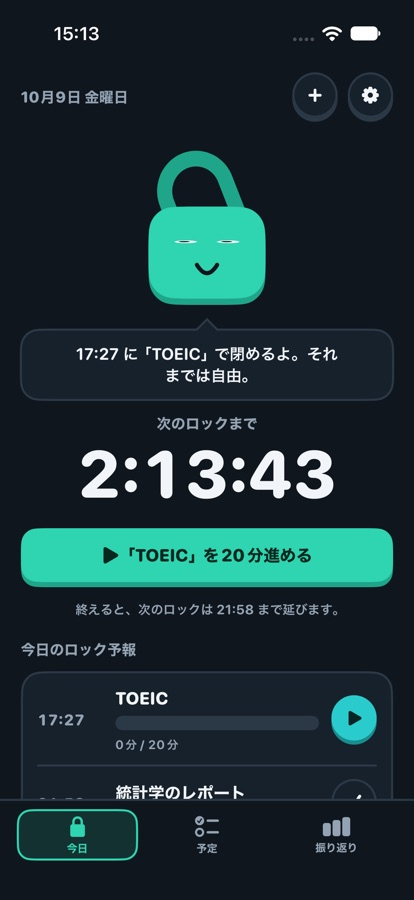 | 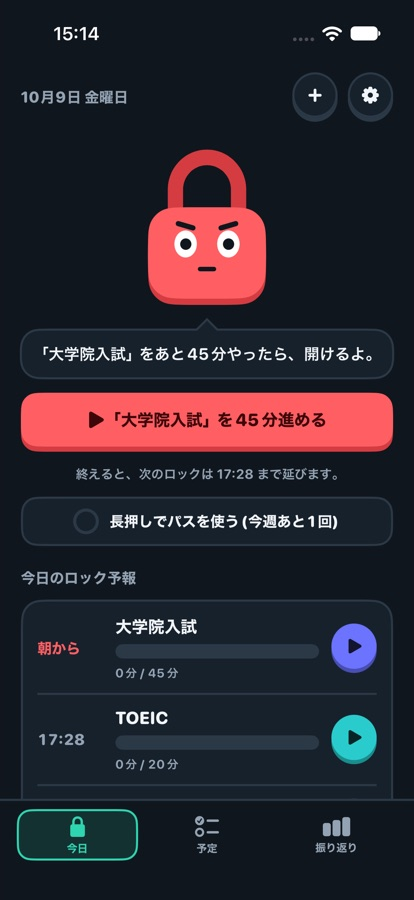 | 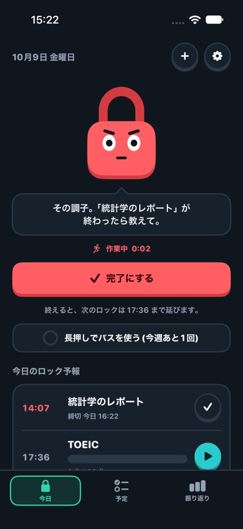 | 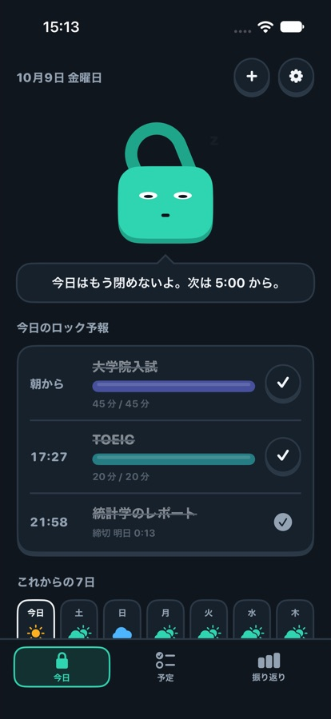 |

## 集中

| 計測中 | 途中で止めたとき |
|---|---|
| 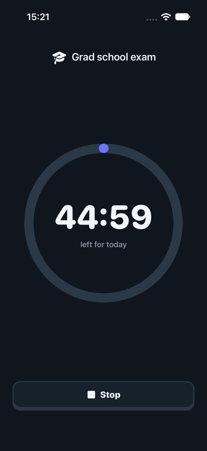 | 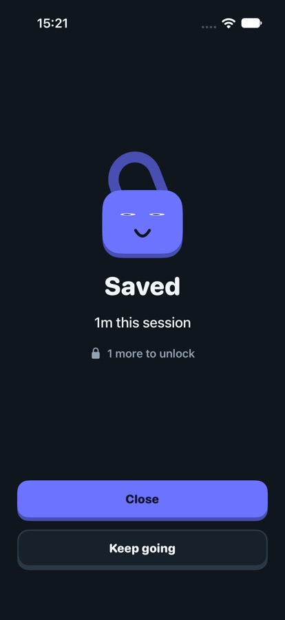 |

今日の分に達したときの演出(波紋、紙吹雪、振動)は、まだ撮れていません。

## 予定と振り返り

| 予定 | 振り返り |
|---|---|
| 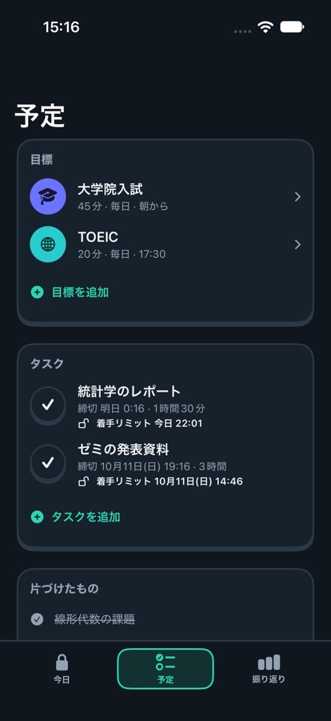 | 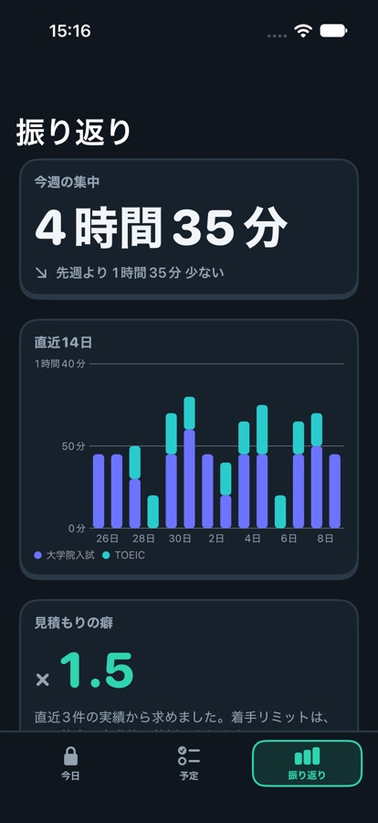 |

## タスクの追加と完了

| 1行入力を反映したあと | 完了のとき |
|---|---|
| 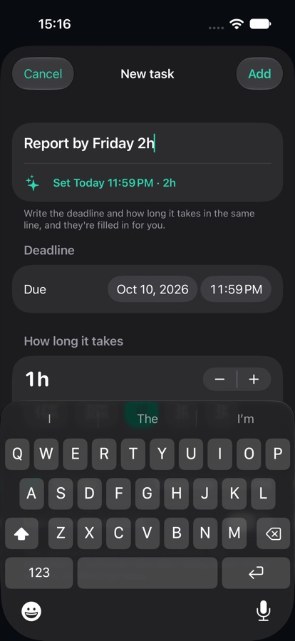 | 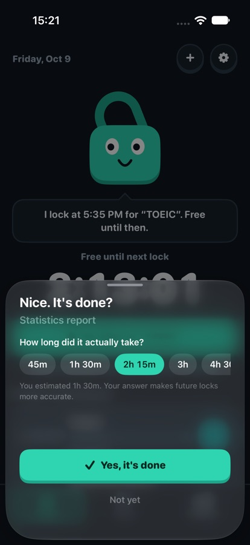 |

## 初回設定

| 導入 | 最初の目標 |
|---|---|
| 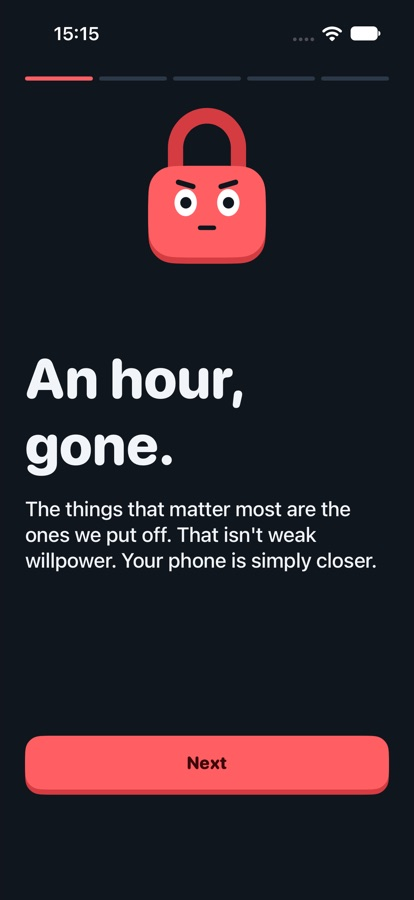 | 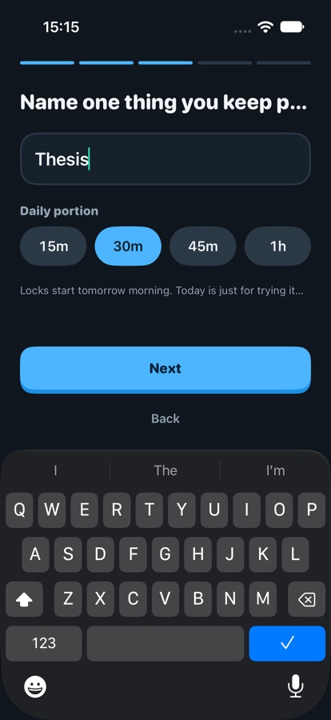 |

## まだ撮れていないもの

- ウィジェット(ホーム画面、ロック画面)
- Live Activity と Dynamic Island
- コントロールセンターのボタン
- 実際のロック画面(実機と有料の開発者登録が必要)
